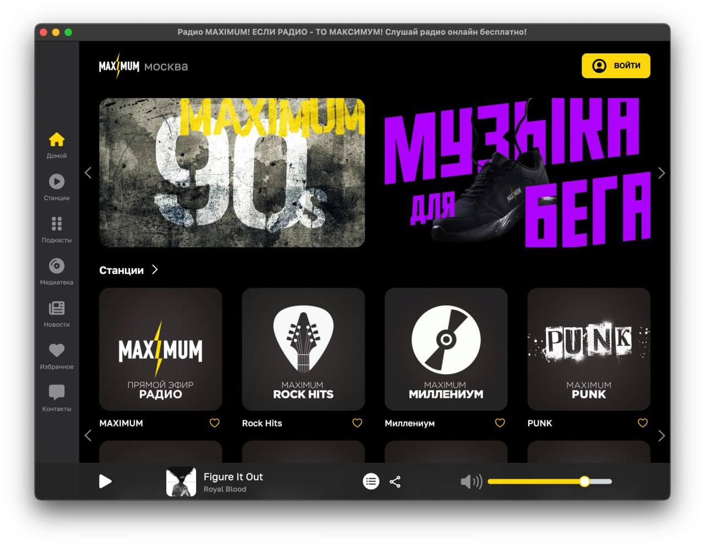

Радио Максимум Electron — это мощное и удобное приложение, предназначенное для прослушивания потока радиостанции "Радио Максимум" на вашем компьютере под управлением операционных систем Windows, Linux и macOS. Этот плеер сочетает в себе простоту использования с высокой функциональностью, обеспечивая вам доступ к потоку в реальном времени с минимальными усилиями.

 

**Особенности:**

1. **Прослушивание в реальном времени:** Получайте доступ к потоку "Радио Максимум" в реальном времени, наслаждаясь любимыми музыкальными композициями, новостями и интересными программами.

2. **Простой и интуитивно понятный интерфейс:** Плеер обладает чистым и интуитивно понятным интерфейсом, что делает его доступным для пользователей с любым уровнем опыта.

3. **Многофункциональность:** Настройте поток в соответствии с вашими предпочтениями благодаря различным функциям, включая регулировку громкости, повтор и перемешивание треков.

4. **Кроссплатформенная поддержка:** Доступен для установки и использования на операционных системах Windows, Linux и macOS, обеспечивая удобство для широкого круга пользователей.

5. **Минимальное потребление ресурсов:** Плеер Радио Максимум оптимизирован для эффективного использования ресурсов вашего компьютера, обеспечивая плавную и бесперебойную работу.

**Как использовать:**

Просто скачайте приложение (https://github.com/demensdeum/Radio-Maximum-Electron/releases), установите его на вашем компьютере и откройте. Выберите "Радио Максимум" из списка доступных станций и наслаждайтесь прослушиванием ваших любимых треков и программ в реальном времени.

С Радио Максимум Electron вы всегда останетесь в курсе последних музыкальных новинок, новостей и интересных программ.

Автор не имеет отношение к Радио Максимум, ему просто очень нравится это радио.  
Основной функционал реализован проектом https://github.com/nativefier/nativefier  
Лицензия на скрипты сборки MIT, у рантайма своя лицензия!